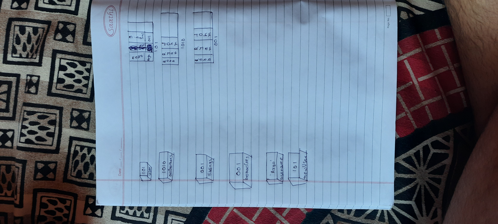

```js
let user = {
  name: "Arya",
  sibling: ["Robb", "Ryan", "John"],
};
let allBrothers = ["Robb", "Ryan", "John"];
let brothersCopy = user.sibling;
let usename = user.name;
let newUser = user;
```

1. Memory representation

- Create the memory representation of the above snippet on notebook.
- Take a photo/screenshot and add it to the folder `code`

<!-- To add this image here use  -->

2. Answer the following with reason:

- `user == newUser;` // output and reason true,as both have stored same address in them

- `user === newUser;` // output and reason true,as both have stored same address in them

- `user.name === newUser.name;` // output and reason true,as both have stored same address in them

- `user.name == newUser.name;` // output and reason true,as both have stored same address in them

- `user.sibling == newUser.sibling;` // output and reason true,as both have stored same address in them
- `user.sibling === newUser.sibling;` // output and reason true,as both have stored same address in them
- `user.sibling == allBrothers;` // output and reason false,as both dont have stored same address in them
- `user.sibling === allBrothers;` // output and reason false,as both dont have stored same address in them
- `brothersCopy === allBrothers;` // output and reason false,as both dont have stored same address in
  them
- `brothersCopy == allBrothers;` // output and reason false,as both dont have stored same address in
  them
- `brothersCopy == user.sibling;` // output and reason true,as both have stored same address in them

- `brothersCopy === user.sibling;` // output and reason true,as both have stored same address in them

- `brothersCopy[0] === user.sibling[0];` // output and reason true,as both have stored same values in them
- `brothersCopy[1] === user.sibling[1];` // output and reason true,as both have stored same values in them
- `user.sibling[1] === newUser.sibling[1];` // output and reason true,as both have stored same values in them
